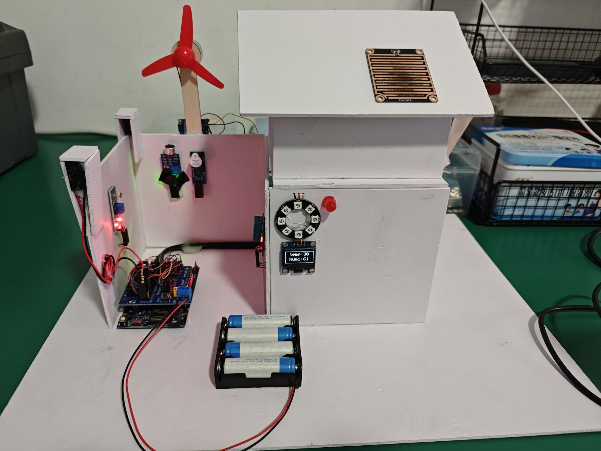
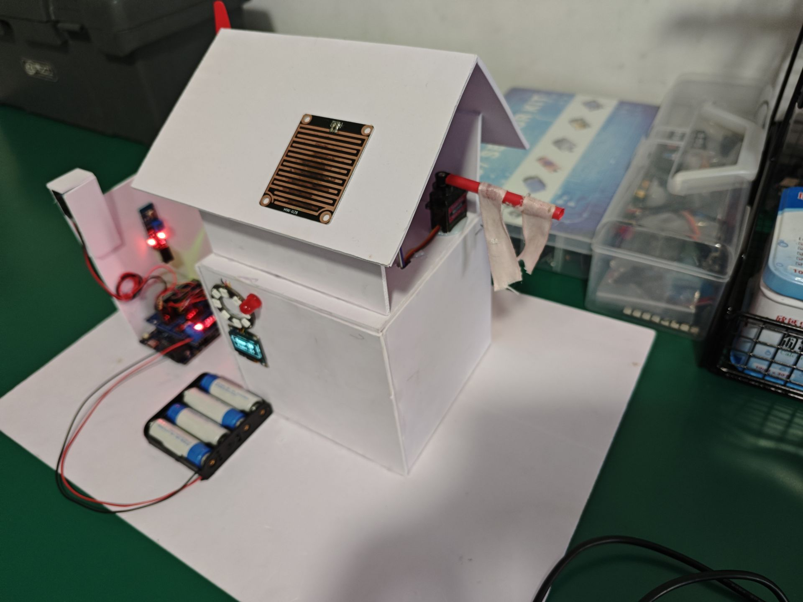
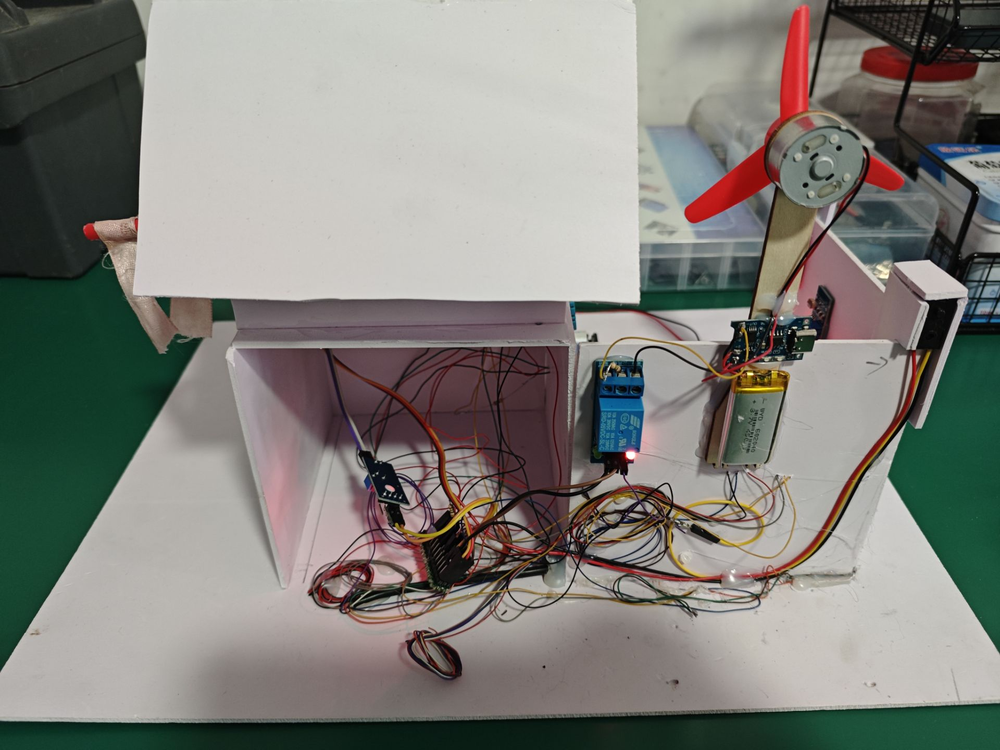
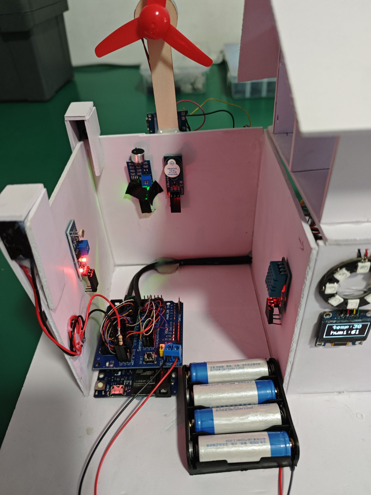

# SmartHome
## 项目概述

这个基于Arduino的智能家居监控系统具备以下功能：
- 实时监测环境温度和湿度，并在OLED屏幕显示
- 根据光线和声音信号自动控制房屋前大灯
- 检测入侵行为（通过红外对射传感器）并触发声光警报
- 根据环境温度自动控制风扇（通过继电器）
- 可通过雨滴传感器控制舵机动作

## 硬件准备

| 组件名称         | 数量 | 用途说明                     |
|------------------|------|------------------------------|
| Arduino开发板    | 1    | 主控制单元（推荐UNO）        |
| SSD1306 OLED显示屏 | 1    | 显示温湿度数据（128x64像素） |
| DHT11温湿度传感器 | 1    | 采集环境温湿度数据           |
| WS2812B RGB灯带  | 1    | 声光警报指示（8个LED）       |
| 声音传感器模块   | 1    | 检测环境声音                 |
| 光敏电阻模块     | 1    | 检测环境光照强度             |
| 红外对射传感器   | 1    | 检测入侵行为                 |
| 舵机             | 1    | 可用于控制门窗等装置         |
| 蜂鸣器           | 1    | 声音警报                     |
| 继电器模块       | 1    | 控制风扇等大功率设备         |
| 红色LED灯        | 1    | 模拟房屋前大灯               |
| 杜邦线           | 若干 | 电路连接                     |
| 雨滴传感器         | 1    | 检测是否下雨              |

## 电路连接

| 组件          | 连接到Arduino的引脚 | 备注                 |
|---------------|---------------------|----------------------|
| OLED显示屏    | SDA -> A4           | I2C通信              |
|               | SCL -> A5           |                      |
| DHT11传感器   | 数据脚 -> D2        |                      |
| WS2812B灯带   | 数据脚 -> D4        |                      |
| 声音传感器    | 输出脚 -> D6        |                      |
| 光敏电阻      | 输出脚 -> D10       |                      |
| 红外对射传感器| 输出脚 -> D7        | 已设置内部上拉电阻   |
| 红色LED灯     | 正极 -> D3          | 需串联限流电阻       |
| 蜂鸣器        | 控制脚 -> D5        |                      |
| 继电器模块    | 控制脚 -> D11       | 低电平有效           |
| 舵机          | 信号脚 -> D8        |                      |
| 雨滴传感器      | 一端 -> D9          |                      |

## 软件准备

### 必要软件
- [Arduino IDE](https://www.arduino.cc/en/software)：用于编写、编译和上传代码到开发板

### 所需库文件
通过Arduino IDE的「库管理器」搜索并安装以下库：
- `Wire.h`：I2C通信库（通常默认安装）
- `Adafruit GFX Library`：图形显示库
- `Adafruit SSD1306`：SSD1306显示屏驱动库
- `DHT sensor library`：DHT系列传感器库
- `Adafruit NeoPixel`：WS2812B灯带控制库
- `Servo`：舵机控制库（通常默认安装）

## 代码结构说明

代码主要分为三个核心部分：

1. **库文件与宏定义区**
   - 引入所有必要的库文件
   - 定义引脚编号、设备参数等常量
   - 声明全局变量和硬件对象

2. **初始化设置（setup函数）**
   - 配置各引脚的输入/输出模式
   - 初始化串口通信
   - 启动各硬件设备（传感器、显示屏、灯带等）
   - 检查设备初始化状态，处理错误

3. **主循环逻辑（loop函数）**
   - 周期性读取传感器数据（温湿度、光线、声音等）
   - 在显示屏上更新显示内容
   - 执行自动化控制逻辑：
     - 灯光自动控制
     - 入侵检测与警报触发
     - 温度控制风扇
     - 按钮控制舵机

## 核心功能实现说明

### 1. 温湿度监测与显示
- 通过DHT11传感器周期性采集环境温度和湿度数据
- 在OLED屏幕上以清晰格式显示数据，包含边框和文字标识
- 每次循环都刷新显示内容，确保数据实时性

### 2. 自动灯光控制
- 光敏电阻检测环境光照强度，判断是否处于"天黑"状态
- 声音传感器检测环境中的声音信号，判断是否有活动
- 当两个条件同时满足时，自动开启房屋前的红色LED大灯
- 灯光开启后保持5秒，避免频繁闪烁

### 3. 入侵检测与警报系统
- 红外对射传感器监测是否有物体遮挡（入侵行为）
- 检测到入侵时：
  - 触发蜂鸣器发出声音警报
  - 控制WS2812B灯带显示红色警示
  - 开启房屋前大灯加强警示效果
- 警报状态持续5秒，之后自动复位（无入侵时）

### 4. 温度控制风扇
- 持续监测环境温度变化
- 当温度达到或超过31℃时，通过继电器模块自动开启风扇
- 温度低于31℃时，自动关闭风扇，实现智能温控

### 5. 舵机控制功能
- 通过按钮状态切换控制舵机的两种工作状态
- 状态1：舵机旋转至0°位置
- 状态2：舵机旋转至90°位置
- 使用状态变量记录当前状态，避免重复动作

## 系统测试与调试

### 测试步骤
1. 检查电路连接：按照电路连接图逐一核对各组件接线
2. 上传程序：将代码编译并上传到Arduino开发板
3. 功能测试：
   - 环境光测试：遮挡光敏电阻（模拟天黑）+ 发出声音 → 大灯应开启
   - 入侵测试：遮挡红外对射传感器 → 警报（蜂鸣器+灯带）应触发
   - 温控测试：用手捂住DHT11传感器 → 温度升高后风扇应自动开启
   - 舵机测试：按下控制按钮 → 舵机应在0°和90°之间切换

### 常见问题及解决方法
- **OLED显示异常**：检查I2C接线（SDA、SCL）是否正确，确认显示屏地址是否为0x3C
- **传感器数据不稳定**：检查传感器接线，必要时更换传感器或增加滤波处理
- **舵机抖动**：确保电源供电稳定，可能需要为舵机提供外部独立电源
- **警报误触发**：调整红外对射传感器位置，避免阳光直射，可增加遮挡外壳
